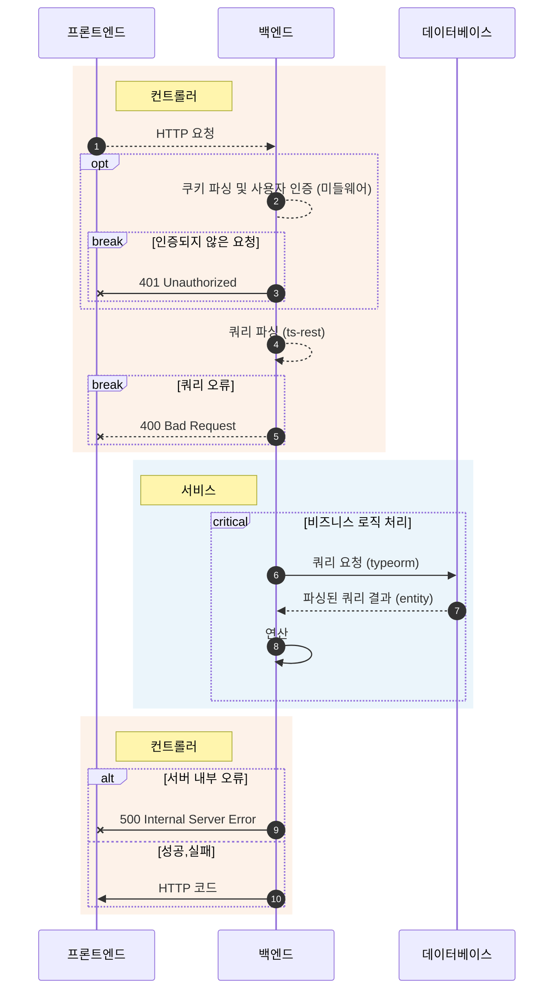

# 프로젝트 개요

## 디렉터리 구조

```
.
├── backend
│   └── src
│       ├── @types # 타입 패치 파일
│       ├── config # 환경 변수 파싱 및 설정
│       ├── entity # typeorm 엔티티 및 뷰
│       ├── v1 # 기존 API (/api)
│       └── v2 # 신규 API (/api/v2)
├── contracts # v2 API 명세
├── database # 배포/로컬 mysql 데이터베이스 (주의: 업데이트/테스트되지 않음)
├── docs # 개발 가이드
├── nginx # nginx 설정 파일
└── scripts # AWS 배포 이후 docker-compose 실행용 스크립트
```

집현전 백엔드는 `contracts/`와 `backend/`로 나뉜 모노레포입니다.

## 순서도 (V2)

> 순서도 문법은 [mermaid 공식 문서](https://mermaid-js.github.io/mermaid/#/sequenceDiagram)를 참고해주세요.



점선: 라이브러리/프레임워크가 제공하는 기능

### 컨트롤러

- 프론트엔드에서 HTTP 요청을 보냅니다.
- 인증이 필요한 경로일 시 미들웨어에서 쿠키를 파싱해 사용자를 인증(authentication)합니다. 인증되지 않은 요청일 시 401 Unauthorized[^auth]를 반환합니다.
- [ts-rest] [^ts-rest]에서 쿼리를 파싱합니다. 올바르지 않은 쿼리일 시 400 Bad Request를 반환합니다.
- 필요한 모든 정보를 인자에 담아 서비스 하나를 호출합니다.

### 서비스

- [typeorm](https://typeorm.io) [^typeorm] 또는 [mysql2](https://github.com/sidorares/node-mysql2) [^mysql2]로 데이터베이스에 접근해 필요한 자료를 가져옵니다.
- 비즈니스 로직을 처리합니다.
- 결과를 컨트롤러에게 반환합니다. 
  - 성공시 DTO를 반환합니다.
  - 서버 내부 오류는 예측이 불가능하므로 예외를 `throw`합니다.
  - 인가(authorization) 오류 등 예측 가능한 실패는 `Error` 클래스를 **`throw`하지 않고** 명시적인 값으로 반환합니다. 

### 컨트롤러

- 서비스에서 반환한 값을 HTTP 코드와 body로 변환해 프론트엔드에게 반환합니다.
- 반환값은 [ts-rest]에서 지정한 타입을 따라야 합니다.
- 서버 내부 오류는 미들웨어에서 처리해 500 Internal Server Error를 반환합니다.

[ts-rest]: https://ts-rest.com/
[^auth]: https://stackoverflow.com//questions/3297048/403-forbidden-vs-401-unauthorized-http-responses#answer-6937030
[^ts-rest]: 프론트엔드와 백엔드가 공유하는 `계약(contract)`을 작성해 타입 안전하게 HTTP 요청과 응답을 할 수 있게 해주는 라이브러리입니다.
[^typeorm]: 데이터베이스 ORM입니다. select와 queryBuilder 사용시 타입 안전하지 않습니다.
[^mysql2]: raw query 라이브러리입니다. 타입 안전하지 않습니다.

## API 경로

### V1

로컬 서버의 `http://localhost:3000/swagger/` 경로를 참고해주세요.

### V2

로컬 서버의 `http://localhost:3000/swagger-v2/` 경로를 참고해주세요.

